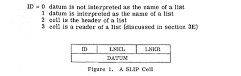
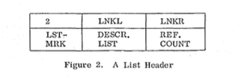
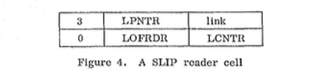

% SLIP – eine Sprache zwischen den Stühlen
% Jörg Kantel

## Einleitung

Das legendäre Computerprogramm ELIZA wurde vor 50 Jahren von *Joseph Weizenbaum* geschrieben. Es gilt heute als der Vorläufer der Chatbots. Anläßlich dieses runden Jubiläums wurde am 2. Oktober 2016 im Rahmen des *Vintage Computing Festivals Berlin* (VCFB) eine Kurztagung unter den Titel »Hello, I’m ELIZA« durchgeführt.

Dieser Beitrag ist die Ausarbeitung eines Vortrages, den ich anläßlich dieser Kurztagung gehalten hatte.

Obiger Screenshot zeigt übrigens, was dabei herauskommt, wenn man nach MAD-SLIP googelt.

## Was ist SLIP?

Das Programm ELIZA wurde 1966 von Joseph Weizenbaum in der Sprache SLIP geschrieben, genauer in MAD-SLIP [^1]. Die Sprache SLIP wurde von Weizenbaum selber entwickelt. Der Name SLIP steht für **S**ymmetric **LI**st **P**rocessor -- ob es tatsächlich auch als Anagramm für LISP gedacht war (meine erste Vermutung), ist mir nicht belegbar. SLIP ist weniger eine eigene Sprache als eine Sammlung von Routinen für Listen, die in eine höhere Programmiersprache (Wirtssprache) eingebettet werden können. SLIPs Kernroutinen wurden in Assembler der IBM 7094 geschrieben, die meisten Routinen jedoch in der Wirtssprache implementiert.
  
[^1]: [Weizenbaum 1966], Seite 36

Es gab drei Versionen von SLIP, zuerst das 1963 entwickelte  FORTRAN-SLIP (eingebettet in FORTRAN IV), danach das vor 1966 in MAD implementierte MAD-SLIP, die Version, in der Weizenbaum ELIZA schrieb und schließlich das um 1968/1969 entstandene ALGOL-SLIP, dessen Wirtssprache ALGOL 60 war.

Dieser Beitrag beschäftigt sich vornehmlich mit MAD-SLIP, wegen der dünnen Quellenlage wurde aber auch auf Veröffentlichungen zu den anderen SLIP-Dialekten zurückgegriffen. Es ist anzunehmen, daß die Unterschiede zwischen diesen Dialekten nicht allzu signifikant waren. Lediglich bei der *Garbage Collection* (siehe weiter unten) könnte Weizenbaum auf Eigenschaften zurückgegriffen haben, die nur in der Wirtssprache ALGOL 60 zur Verfügung standen und das in den Vorgängerversionen die Speicherbereinigung noch von Hand erfolgen mußte.

Das Einbetten von SLIP in eine andere Programmiersprache hatte den Vorteil, daß der Programmierer, der mit der Wirtssprache vertraut war, keine neue Sprache lernen mußte, sondern nur die neu hinzugekommenen Routinen zur Listenverarbeitung.

### Die Entwicklung von MAD und (MAD-) SLIP

MAD-SLIP ist die Fassung von SLIP, in der ELIZA geschrieben wurde. Die Wirtssprache **MAD** (**M**ichigan **A**lgorithm **D**ecoder) war eine von ALGOL 58 beeinflußte Sprache, die unter anderem auf den IBM Mainframes der 7000er Serie lief. Am MIT wurde anfang der 1960-Jahre das Timesharing-Betriebssystem CTSS[^2] (Compatible Time-Sharing System) entwickelt. Es lief auf einer modifizierten IBM 7094 und wurde bis 1973 genutzt. Das »Compatible« im Namen bezog sich auf die Möglichkeit, eine unveränderte Kopie des *Fortran Monitor Systems* (FMS) im Hintergrund auszuführen. Dadurch war es möglich, die unter einem Stapelverarbeitungs-Betriebssystem entwickelten Programme auch unter dem Time-Sharing-Betriebssystem weiter zu nutzen.

[^2]: https://de.wikipedia.org/wiki/Compatible_Time-Sharing_System

MAD konnte -- im Gegensatz zu FORTRAN, das bis heute nur im Batch-Betrieb (Stapelverarbeitung) läuft -- die Fähigkeiten des CTSS nutzen. Ein Programm wie ELIZA machte natürlich nur unter einem Timesharing-Betriebssystem Sinn und so ist es folgerichtig, daß Weizenbaum seinen Sprachaufsatz nach MAD übertragen hatte.

Eine Besonderheit von MAD war, daß in einer frühen Version bei einer größeren Anzahl von Programmierfehlern der Compiler eine ganzseitige Fehlermeldung[^alfred] mit dem Portrait Alfred E. Neumanns ausgab[^mad], dem Maskottchen der damals schon beliebten Comic- und Satirezeitschrift *Mad*. Dieses Feature wurde aber nicht in die finale Version übernommen.

[^alfred]: Bildquelle (PD) Wikimedia Commons: https://en.wikipedia.org/wiki/MAD_(programming_language)#/media/File:MAD-alfie-1960.jpg
[^mad]: https://en.wikipedia.org/wiki/MAD_(programming_language)

SLIP war ursprünglich am *Computer Development Laboratory* der *General Electric Corporation* für numerische Aufgaben entwickelt worden, Weizenbaum selber[^w1963] nennt vier frühere List-Prozessoren, die SLIP beeinflußt hatten:

[^w1963]: [Weizenbaum 1963], S.

**IPL-V (Information Processing Language)** ist eine Computersprache, die 1956 von *Allen Newell*, *Cliff Shaw* und *Herbert A. Simon* bei der *RAND Corporatio*n und dem *Carnegie Institute of Technology* entwickelt wurde. Bis sich LISP durchsetzte, war IPL lange Jahre die Sprache der KI-Forschung[^3], in der zum Beispiel die Programme *Logic Theorist* (1956), *General Problem Solver* (GPS, 1957) und das Computer-Schachprogramm *NSS* implementiert wurden.

Eines der ersten Projekte mit IPL war der Versuch eines automatisierten, computergestützen Beweises der Theoreme der *Principia Mathematica* von * Bertrand Russell* und *Alfred North Whitehead*. IPL-V wurde dann aber sehr schnell von LISP abgelöst, da LISP die einfachere Syntax und vor allem eine automatische *Garbage Collection* besaß.

[^3]: Vgl. [Nilson 2010]

**FLPL** steht für **FORTRAN List Processing Language**[^flpl] und wurde bei IBM 1958 für die IBM 704 entwickelt, um damit KI-Programme zu entwickeln (speziell einen Therom-Prüfer für Geometrie nach einer Idee von *Marvin Minsky*).

[^flpl]: Vgl. [Gelernter 1962]

**The Threaded List Language**[^perlis] wurde 1960 von *A.J. Perlis* und *Charles Thornton* auf einem »650 Computer System« am Carnegie Institute of Technology in Pittsburgh in Assembler (TASS) implementiert.

[^perlis]: Vlg. [Perlis 1960]

**Knotted Lists Structures** (KLS) – von Weizenbaum selber geschrieben[^kls], ist der direkte Vorgänger von SLIP.

[^kls]: Vgl. [Weizenbaum 1962]

### Exkurs: LISP

**LISP** (**LIS**t **P**rocessing) entstand 1958/1959 am MIT und gehört bis heute zu den wichtigsten Programmiersprachen der Künstlichen Intelligenz (KI).

## Die Hardware: IBM 7094[^7094]

SLIP lief auf einer (damals brandneuen – 1962) IBM 7094, dem Nachfolgemodell der IBM 7090. Die IBM 7090 war der erste Transistor-Großrechner für den wissenschaftlichen Bereich, den IBM herstellte, das Vorgängermodelle (IBM 704-Serie) wurden noch mit Röhren betrieben.[^70942]

[^7094]: Bildquelle (CC BY-SA 3.0): Wikimedia Commons – https://en.wikipedia.org/wiki/IBM_7090#/media/File:IBM_7094_console2.agr.JPG
[^70942]: https://en.wikipedia.org/wiki/IBM_7090

Zur Größenordnung: Ein »typisches« System kostete damals etwa 2,9 Millionen US-Dollar (umgerechnet auf die heutige Kaufkraft ca. 23,5 Millionen Dollar), man konnte es aber auch für 63.500 US-Dollar/Monat mieten (umgerechnet auf heutige Kaufkraft ca. 500.000 Dollar).

### Die technischen Daten der IBM 7094

Die Rechner der 7000er-Serie – wie schon die Vorgängermodelle – besaßen eine Wortlänge von 36 Bit. Das Befehlsformat hatte einen 3 Bit-Prefix, ein 15 Bit Decrement und eine 15-Bit Adresse.

Fixpoint Zahlen wurden binär mit einem Bit für das Vorzeichen direkt gespeichert, einfache Fließkommazahlen wurden mit einem 8-Bit Exponenten und einer 27-Bit-Mantisse dargestellt. Double-Float (neu eingeführt mit der IBM 7094) hatten ebenfalls einen 8-Bit Exponenten und eine 54-Bit-Mantisse.

Alphanumerische Werte (das was man heute mit `Strings` bezeichnet) wurden im 6-Bit-BCD-Format gespeichert, 6 Werte in einem Wort.

## SLIPs Spracheigenschaften

Joseph Weizenbaum war von 1952 - 1963 Systemingenieur im *Computer Development Laboratory* der *General Electric Corporation*, wo er FORTRAN-SLIP auf einer IBM 7094 entwickelte, 1963 ging er zum *Massachusetts Institute of Technology* (MIT), zunächst als Associate Professor, ab 1970 als Professor für Computer Science und 1966 schrieb er dort ELIZA, davor hatte er SLIP auf einer mit CTSS modifizierten IBM 7094 in MAD implementiert. Zwischen 1968 und 1969 hatte er dann ncoh am MIT SLIP noch einmal nach Algol 68 übertragen. Danach verschwindet SLIP im Dunkel der frühen Informatikgeschichte.

SLIPs Besonderheit war, daß es wirklich symmetrisch auf Listen operieren konnte. Die Listen hatten keine bevorzugte Orientierung und es gab jeweils symmetrische Befehle, um sowohl auf das erste, wie auch auf das letzte Element der Liste zugreifen zu können. SLIPs Listenelemente, Zellen genannt, hatten eine feste Größe und enthielten die Daten und keine Zeiger auf Daten. Die Größe war abhängig von der Wortlänge der Wirtssysteme.

Ein **SLIP-Listenelement** bestand aus einem Wort-Paar, bestehend aus zwei aufeinanderfolgenden Speichereinheiten (Wörtern): Das erste Wort enthielt ein ID-Feld, ein LINKL- (link left) und ein LINKR- (link right) Feld:

  * das ID-Feld hatte folgende Bedeutungen:
    * 0: Das Datum enthält nicht den Namen der Liste
	* 1: Das Datum enthält den Namen der Liste
	* 2: Die Zelle ist der Header der Liste
	3: Die Zelle ist ein `READER` einer Liste
  * `LINKL` und `LINKR` zeigten auf das vorherige oder das nachfolgende Listenelement
  * Alle Zellen (mit Ausnahme der `READER`) gehörten einer und nur einer Liste

Jede Liste besitzt nur einen **Header** mit der `ID=2`. Das zweite Element eines Headers enthält kein Datum, sondern ist wie in der Abbildung aufgeteilt:

  * In `LSTMRK` stehen dem Nutzer zwei Bit, die der Programmierer für Markierungen nutzen kann
  * `DESCR. LIST` zeigt auf eine Listenbeschreibung (einen Hash) -- wenn vorhanden
  * Der `REF. COUNT` zeigt an, wie oft diese Liste als eine Sub-Liste verwendet wird
  * Wenn `ID=1` wurde durch Konvention `LNKL` und `LNKR` im Datumsbereich jeweils mit dem Namen einer (und nur einer) Liste belegt. So wurden Beziehungen zwischen Listen und Sublisten geknüpft.
  * Jede Liste konnte auch eine Subliste sein.

### SLIP-Programmstruktur

SLIP besaß in der Originalversion 99 Befehle, davon waren knapp 20 in Assembler programmiert, die anderen als FORTRAN-Funktionen implementiert. Nicht alle Befehle waren für den Anwendungsprogrammierer gedacht, einige waren auch für die Programmierung von SLIP selber notwendig und wurden nur intern genutzt.

Die Zahl der von einem Programmierer neu zu erlernden Befehle reduzierte sich noch einmal, wenn man berücksichtigt, daß wegen der Symmetrie alle Listenbefehle doppelt vorhanden waren.

Naturgemäß besaß SLIP sehr viele Befehle, die für die dynamische Generierung von Listen, dem Hinzufügen und Entfernen von Zellen und dem Zugriff auf die einzelnen Zellen benötigt wurden.

### »Sequenzer« und »Reader«

Ein Sequencer ist ein Mechanismus, der eine Operation auf alle Zellen einer Liste nacheinander ausführt. Auch hier ist SLIP symmetrisch. Der Programmierer konnte festlegen, ob die Sequenz von unten nach oben oder von oben nach unten durchgeführt werden soll.

Ein *Sequencer* konnte immer nur über eine Liste iterieren. Sollte auch über alle Sublisten iteriert werden, mußte ein *Reader* implementiert werden. Ein Reader ist wieder ein SLIP-Listenelement, daß sich seine Inhalte aus der LAVS holte. Dabei ist `LPNTR` die Adresse der aktuellen Zelle, `LOFRDR` ist die Adresse des Headers der (Sub-) Liste, über die gerade iteriert wird, `LCNTR` ist ein Zähler für die Tiefe der (Sub-) Listen, die gerade durchlaufen werden und `link` zeigt auf den nächsten Reader im Stack. Denn in einem SLIP-Programm konnten durchaus mehrere Reader existieren, die auch auf den gleichen Listen operieren konnten.

### Description List

Eine *Description List* ist ein Attribut-Wert-Paar (Hash, Dictionary), bestehend aus einem Zellen-Paar, die erste Zelle enthält das Attribut, die zweite Zelle den Wert. *Description Lists* sind keine eigenständigen Sublisten, sondern gehören zu dem Listenheader, der auf sie zeigt. Als Konsequenz können *Description Lists* nicht mit den SLIP-Listenbefehlen manipuliert werden. Für *Description Lists* besaß SLIP einen eigenen Satz von Befehlen.

### Garbage Collection

Da SLIPs Listen dynamisch generiert wurden, waren Routinen zur Speicherbelegung und -freigabe erforderlich. Im Gegensatz zu LISP, das damals schon einen automatischen *Garbage Collector* besaß, war dies in SLIP teils vom Programm, teils vom Programmierer zu erledigen.

Für die dynamische Speicherbelegung nutzte SLIP eine *list of available spaces* (LAVS). Genaugenommen ist dies keine SLIP-Liste, da diese nur in eine Richtung gelesen und geschrieben werden konnte.

LAVS besaß einen Referenzzähler, der auf Null fiel, wenn eine Liste nicht mehr referenziert wurde.

Der Programmierer konnte festlegen, ob in diesem Falle die Liste vom Programm gelöscht und der Speicherplatz freigegeben wird oder ob sie im Speicher bleibt, weil sie später noch einmal benötigt wird.

Es ist möglich, daß es diese halbautomatische Form der Speicherbereinigung erst in ALGOL-SLIP gab und daß in den früheren Versionen, also auch in MAD-SLIP die *Garbage Collection* alleine vom Programmierer zu erledigen war. Weizenbaum hat nämlich erst zu dieser letzten SLIP-Version über die *Garbage Collection*  von SLIP publiziert[^algolslip].

[^algolslip]: Vgl. [Weizenbaum 1969]

### Rekursion

SLIP erlaubte Rekursionen, die auf einem Stack arbeiteten. Über die mögliche Rekursionstiefe ist mir leider nichts bekannt, aber sie kann nicht sehr tief gewesen sein.

### Input - Output

Für die (Nutzer-) Eingaben und die (Programm-) Ausgaben nutzte SLIP die Möglichkeiten des Wirtssystems. Ohne diese wäre ein Programm wie ELIZA auch gar nicht möglich gewesen. Zusätzlich gab es jedoch einen Satz von Befehlen, mit denen SLIP-Listen direkt von Lochkarten eingelesen oder direkt auf Lochkarten geschrieben werden konnten.

## Warum SLIP?

SLIP war ursprünglich nicht für die KI-Forschung entwickelt worden, sondern als Werkzeug für numerische Berechnungen, Manipulationen algebraischer Ausdrücke und der Netzwerk- und Graphenanalyse. In der ersten (FORTRAN-) Version lief SLIP auch nur im Stapelbetrieb.

Für die Entwicklung von ELIZA war es nicht nur vorteilhaft, auf symmetrischen Listen operieren zu können, sondern es spielte mit Sicherheit eine große Rolle, daß MAD-SLIP sich durch das CTSS des MIT vom Stapelbetrieb befreien und im Dialog mit dem Nutzer laufen konnte. Das war zur damaligen Zeit neu und keineswegs selbstverständlich.

Und sicher spielte das Hauptargument aller Programmierer seltsamer Dinge dabei eine Rolle: »Weil es geht!« Denn SLIP war ein Kind von Joseph Weizenbaum und welcher Vater spielt nicht gerne mit seinem Kind.

## DYNAMO – eine interessante Parallele

**DYNAMO** (**DYNA**mic **MO**dels) war eine Simulationssprache (mit begleitender graphischer Notation) für den Bereich System Dynamics. Die Sprache wurde 1958 unter der Leitung von *Jay Wright Forrester* am MIT entwickelt. Die erste Version war in Assembler für die IBM 704, 709 und 7090, DYNAMO II in AED-0, einer erweiterten Version von Algol 60, geschrieben und ab 1971 waren Dynamo II/F und Dynamo 3 in Gebrauch, die in FORTRAN implementiert worden waren.

DYNAMO wurde bis Mitte der 1980 Jahre für die Simulation dynamischer Systeme genutzt, es gab Anfang der 1980 Jahre auch eine Version für Personal Computer (micro-Dynamo). Später gab es mit Stella ein graphisches Programmiersystem, daß intern wie DYNAMO rechnete und eine Implementierung in (Turbo-) Pascal und eine in Modula-2 (MacMETH an der ETH Zürich).

Der erste Bericht »Die Grenzen des Wachstums« an den Club of Rome beruhte auf Simulationen, die mit DYNAMO durchgeführt worden waren.

DYNAMO war im Gegensatz zu SLIP kein Sprachaufsatz, sondern eine eigenständige *Domain Specific Language* (DSL). Dennoch verleiteten mich die historischen Parallelen zwischen diesen beiden Sprachen zu meiner (falschen) Anfangshypothese, daß SLIP ebenfalls eine DSL gewesen sei.

## Und warum nicht LISP?

Seit 1958 wurde LISP von *John McCarthy* am MIT entwickelt und von einer Gruppe von Studenten um McCarthy und *Marvin Minsky* (seit 1959 am MIT) intensiv genutzt und ersetzte dort das bis dahin verwendete IPL. LISP wurde zuerst auf einer IBM 704 des MIT entwickelt, nachdem die Gruppe aber feststellte, daß diese nicht gegnügend Speicher für ihre Programme besaß, auf einer DEC PDP-1 implementiert. Dann folgte eine PDP-6 und eine PDP-10.

1963 stieß *Jean Piaget* als Co-Direktor zu der Gruppe um Marvin Minsky, während McCarthy nach Stanford ging (wo er ebenfalls mit einer PDP-6 und später mit einer PDP-10 arbeiten konnte).

Nilsons Buch »The Quest for Artificial Intelligence« läßt eine Art *Cultural Clash* zwischen der Mainframe-Fraktion am MIT (Weizenbaum, Forrester) und der jungen KI-Gruppe vermuten (»jung« im Sinne von »junges« Forschungsfeld).

Auch in »Die Macht der Computer und die Ohnmacht der Vernunft« äußert sich Weizenbaum skeptisch gegenüber »höheren« Programmiersprachen: Sie entfremde den Programmierer von den Maschinen-Details. Er (der Programmierer) wisse nicht mehr, wie die Maschine eine Operation durchführt. Dies ist aus dem Standpunkt eines Numerikers ein durchaus ernst zu nehmendes Argument.

Außerdem erzählte *Wolfgang Coy*[^coy] auf der Tagung, daß es zwischen der Gruppe um John McCarthy und Joseph Weizenbaum tiefgehende Differenzen darüber gab, was die Förderung der Forschung durch Militär und Rüstungsindustrie betrifft. Es ist anzunehmen, daß dies zu einem Zerwürfnis zwischen den beiden führte und dies eine der Gründe für den Widerwillen Weizenbaums gegenüber LISP war.

[^coy]: Vgl. seinen Beitrag in diesem Band

## Und so blieb SLIP die Sprache zwischen den Stühlen

Auf dem einen Stuhl saßen mit FORTRAN und ALGOL (und vorrübergehend auch MAD) die Sprachen der Mainframe-Boliden, die im Falle von ALGOL bis in die 1980er Jahre und im Falle von FORTRAN sogar bis heute das Feld dominieren.

Auf dem zweiten Stuhl hockte LISP, die (neue) Sprache der KI, die weniger auf Mainframes, sondern mehr auf Workstations und MDT-Rechnern[^MDT] (und später auch auf Personalcomputern) das Forschungsfeld der Künstlichen Intelligenz dominierte.

Und dazwischen klemmte das arme, kleine SLIP, das -- obwohl von seinem Vater liebevoll gepflegt -- vermutlich von niemandem anderen als von Weizenbaum und seiner Gruppe genutzt wurde.

[^MDT]: MDT: **M**ittlere **D**aten**T**echnik

## Literatur

  * [Gelernter 1960] H. Gelernter, J. R. Hansen, C. L. Gerberich: *A Fortran-Compiled List-Processing Language*, Journal of the ACM, Volume 7 Issue 2, April 1960, Pages 87-101
  * [MAD 1962] Digital Computer Laboratory der University of Illinois: *A User's Reference Manual For The Michigan Algorithm Decoder (MAD) For The IBM 7090*, 1962
  * [Neumann 2016] Alexander Neumann: *[Vor 60 Jahren: IBM veröffentlicht erste Sprachspezifikation für Fortran](https://www.heise.de/developer/meldung/Vor-60-Jahren-IBM-veroeffentlicht-erste-Sprachspezifikation-fuer-Fortran-3351318.html)*, heise Developer vom 17. Oktober 2016
  * [Nilson 2010] Nils J. Nilson: *The Quest for Artificial Intelligence. A History of Ideas and Achievements*, New York (Cambridge University Press) 2010
  * [Perlis 1960] A.J. Perlis, Charles Thornton: *Symbol Manipulation by threaded lists,*, Communications of the ACM, Volume 3, Issue 4, April 1960
  * [Smith 1967] Douglas K. Smith: *An Introduction to the List-Processing Language SLIP*, in Saul Rosen (ed.) Programming Systems and Languages, New York (McGraw-Hill) 1967, p. 393-418
  * [Weizenbaum 1962] Joseph Weizenbaum et. al.: *Knotted List Structures*, Sunnyvale, Ca. (Computer Organization Unit – General Electric Computer Laboratory) 1962
  * [Weizenbaum 1963] Joseph Weizenbaum: *Symmetric List Processor*, Communications of the ACM, Volume 6, Number 9, September 1963, p. 524-536
  * [Weizenbaum 1966] Joseph Weizenbaum: *ELIZA – A Computer Program For the Study of Natural Language Communication Between Man And Machine*, Communications of the ACM, Volume 9, Number 1, January 1966, p. 36-45
  * [Weizenbaum 1969] Joseph Weizenbaum: *Recovery of Reentrant List Structures in SLIP*, Communications of the ACM, Volume 12, Number 7, July 1969, p. 370-372
  * [Weizenbaum 1980] Joseph Weizenbaum: *Die Macht der Computer und die Ohnmacht der Vernunft*, Frankfurt/Main (Suhrkamp), 2. Auflage 1980
  * [Wexelblat 1981] Richard L. Wexelblat (ed.): *History of Programming Languages*, New York (Academic Press) 1981

