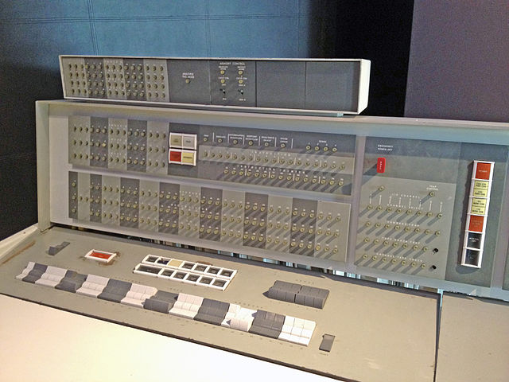

% SLIP – eine Sprache zwischen den Stühlen

## Einleitung

Joseph Weizenbaums legendäres Computerprogramm ELIZA wurde vor 50 Jahren – laut der Wikipedia – im MAD-SLIP geschrieben. Es gilt heute als der Vorläufer der Chatbots. Anläßlich dieses runden Jubiläums wurde am 2. Oktober 2016 im Rahmen des *Vintage Computing Festivals Berlin* (VCFB) eine Kurztagung unter den Titel »Hello, I’m ELIZA« durchgeführt.

Ich hatte die Ehre, unter dem Titel »SLIP – eine Sprache zwischen den Stühlen« etwas zur konkreten Implementierung dieses Programms zu erzählen. Nun will ich diesen Vortrag in einen Artikel für den Tagungsband verwandeln. Und dieses Projekt ist gleichzeitig mein Testballon mit Tufte CSS und Tufte LaTeX.

## Was ist SLIP?

Das Programm ELIZA wurde 1966 von Joseph Weizenbaum in der Sprache SLIP geschrieben, laut Wikipedia in MAD-SLIP. Die Sprache SLIP wurde von Weizenbaum selber entwickelt.

  * SLIP: **S**ymmetric **LI**st **P**rocessor
  * SLIP ist eine Sammlung von Routinen für Listen, die in eine höhere Programmiersprache (Wirtssprache) eingebettet werden können.
  * SLIPs Kernroutinen wurden in Assembler geschrieben, die anderen in der Wirtssprache implementiert.

Es gab drei Versionen von SLIP:

  * FORTRAN-SLIP (eingebettet in FORTRAN IV, 1963)
  * MAD-SLIP (eingebettet in MAD – Michigan Algorithm Decoder)
  * ALGOL-SLIP (eingebettet in ALGOL 60)

Das Einbetten von SLIP in eine andere Programmiersprache, hatte den Vorteil, daß der Programmierer keine neue Sprache lernen mußte, sondern nur die Routinen zur Listenverarbeitung.

MAD-SLIP ist die Fassung von SLIP, in der ELIZA geschrieben wurde. Die Wirtssprache **MAD** ()**M**ichigan **A**lgorithm **D**ecoder) war eine von ALGOL beeinflußte Sprache, die unter anderem auf den IBM 7094 Mainframes mit dem Timesharing-Betriebssystem CTSS lief. CTSS wurde Anfang der 1960er-Jahre am MIT entwickelt und bis 1973 genutzt.

Weizenbaum nennt vier frühere List-Prozessoren, die SLIP beeinflußt haben:

**IPL-V (Information Processing Language)** ist eine Computersprache, die 1956 von *Allen Newell*, *Cliff Shaw* und *Herbert A. Simon* bei der RAND Corporation und dem Carnegie Institute of Technology entwickelt wurde. Bis sich LISP durchsetzte, war IPL lange Jahre die Sprache der KI-Forschung, in der zum Beispiel die Programme Logic Theorist (1956), General Problem Solver (GPS, 1957) und das Computer-Schachprogramm NSS implementiert wurden.

**FLPL** steht für FORTRAN List Processing Language und wurde bei IBM 1958 für die IBM 704 entwickelt, um damit KI-Programme zu entwickeln (speziell einen Therom-Prüfer für Geometrie nach einer Idee von Marvin Minsky).

**The Threaded List Language** wurde 1960 von *A.J. Perlis* und *Charles Thornton* auf einem »650 Computer System« am Carnegie Institute of Technology in Pittsburgh in Assembler (TASS) implementiert.

**Knotted Lists Structures** (KLS) – von Weizenbaum selber geschrieben, ist der direkte Vorgänger von SLIP.

SLIPs Besonderheit war, daß es wirklich symmetrisch auf Listen operieren konnte. Die Listen hatten keine bevorzugte Orientierung und es gab jeweils symmetrische Befehle, um sowohl auf das erste, wie auch auf das letzte Element der Liste zugreifen zu können. SLIPs Listenelemente, Zellen genannt, hatten eine feste Größe und enthielten die Daten und keine Zeiger auf Daten. Die Größe war abhängig von der Wortlänge der Wirtssysteme.

### Exkurs: LISP

**LISP** (**LIS**t **P**rocessing) entstand 1958/1959 am MIT und gehört bis heute zu den wichtigsten Programmiersprachen der Künstlichen Intelligenz (KI).

## Die Hardware: IBM 7094

SLIP lief auf einer (damals brandneuen – 1962) IBM 7094, dem Nachfolgemodell der IBM 7090. Die IBM 7090 war der erste Transistor-Großrechner für den wissenschaftlichen Bereich, den IBM herstelte, das Vorgängermodelle (IBM 704-Serie) wurden noch mit Röhren betrieben.

Zur Größenordnung: Ein »typisches« System kostete damals etwa 2,9 Millionen US-Dollar (umgerechnet auf die heutige Kaufkraft ca. 23,5 Millionen Dollar), man konnte es aber auch für 63.500 US-Dollar/Monat mieten (umgerechnet auf heutige Kaufkraft ca. 500.000 Dollar).

Die technischen Daten der IBM 7094

  * Die Rechner der 7000er-Serie – wie schon die Vorgängermodelle – besaßen eine Wortlänge von 36 Bit
  * Das Befehlsformat hatte einen 3 Bit-Prefix, ein 15 Bit Decrement und eine 15-Bit Adresse
  * Fixpoint Zahlen wurden binär mit einem Bit für das Vorzeichen direkt gespeichert
  * Einfache Fließkommazahlen wurden mit einem 8-Bit Exponenten und einer 27-Bit-Mantisse dargestellt
  * Double-Float (neu in der IBM 7094) hatten ebenfalls einen 8-Bit Exponenten und eine 54-Bit-Mantisse
  * Alphanumerische Werte wurden im 6-Bit-BCD-Format gespeichert, 6 Werte in einem Wort

## Joseph Weizenbaum

Joseph Weizenbaum war von 1952 - 1963 Systemingenieur im Computer Development Laboratory der General Electric Corporation, dort wurde SLIP entwickelt, 1963 ging er zum *Massachusetts Institute of Technology* (MIT), zunächst als Associate Professor, ab 1970 als Professor für Computer Science und 1966 schrieb er dort ELIZA

## SLIP

SLIPs Besonderheit war, daß es wirklich symmetrisch auf Listen operieren konnte. Die Listen hatten keine bevorzugte Orientierung und es gab jeweils symmetrische Befehle, um sowohl auf das erste, wie auch auf das letzte Element der Liste zugreifen zu können. SLIPs Listenelemente, Zellen genannt, hatten eine feste Größe und enthielten die Daten und keine Zeiger auf Daten. Die Größe war abhängig von der Wortlänge der Wirtssysteme.

Ein **SLIP-Listenelement** bestand aus einem Wort-Paar, bestehend aus zwei aufeinanderfolgenden Speichereinheiten (Wörtern): Das erste Wort enthielt ein ID-Feld, ein LINKL- (link left) und ein LINKR- (link right) Feld:

  * das ID-Feld hatte folgende Bedeutungen:
    * 0: Das Datum enthält nicht den Namen der Liste
	* 1: Das Datum enthält den Namen der Liste
	* 2: Die Zelle ist der Header der Liste
	3: Die Zelle ist ein `READER` einer Liste
  * `LINKL` und `LINKR` zeigten auf das vorherige oder das nachfolgende Listenelement
  * Alle Zellen (mit Ausnahme der `READER`) gehörten einer und nur einer Liste

Jede Liste besitzt nur einen **Header** mit der `ID=2`. Das zweite Element eines Headers enthält kein Datum, sondern ist wie in der Abbildung aufgeteilt:

  * In `LSTMRK` stehen dem Nutzer zwei Bit, die der Programmierer für Markierungen nutzen kann
  * `DESCR. LIST` zeigt auf eine Listenbeschreibung (einen Hash) -- wenn vorhanden
  * Der `REF. COUNT` zeigt an, wie oft diese Liste als eine Sub-Liste verwendet wird
  * Wenn `ID=1` wurde durch Konvention `LNKL` und `LNKR` im Datumsbereich jeweils mit dem Namen einer (und nur einer) Liste belegt. So wurden Beziehungen zwischen Listen und Sublisten geknüpft.
  * Jede Liste konnte auch eine Subliste sein.

### SLIP-Programmstruktur

SLIP besaß in der Originalversion 99 Befehle, davon waren knapp 20 in Assembler programmiert, die anderen als FORTRAN-Funktionen implementiert.

Nicht alle Befehle waren für den Anwendungsprogrammierer, einige waren auch für die Programmierung von SLIP notwendig

Die Zahl der Befehle reduziert sich auch noch einmal, wenn man berücksichtigt, daß wegen der Symmetrie alle Listenbefehle doppelt vorhanden waren.

Naturgemäß besaß SLIP sehr viele Befehle, die für die dynamische Generierung von Listen, dem Hinzufügen und Entfernen von Zellen und dem Zugriff auf die einzelnen Zellen benötigt wurden.

### »Sequenzer« und »Reader«

Ein Sequencer ist ein Mechanismus, der eine Operation auf alle Zellen einer Liste nacheinander ausführt. Auch hier ist SLIP symmetrisch. Der Programmierer konnte festlegen, ob die Sequenz von unten nach oben oder von oben nach unten durchgeführt werden soll.

Ein *Sequencer* konnte immer nur über eine Liste iterieren. Sollte auch über alle Sublisten iteriert werden, mußte ein *Reader* implementiert werden. Ein Reader ist wieder ein SLIP-Listenelement, daß sich seine Inhalte aus der LAVS holte. Dabei ist `LPNTR` die Adresse der aktuellen Zelle, `LOFRDR` ist die Adresse des Headers der (Sub-) Liste, über die gerade iteriert wird, `LCNTR` ist ein Zähler für die Tiefe der (Sub-) Listen, die gerade durchlaufen werden und link zeigt auf den nächsten Reader im Stack.

Denn in einem SLIP-Programm konnten durchaus mehrere Reader existieren, die auch auf den gleichen Listen operieren konnten.

### Description List

Eine *Description List* ist ein Attribut-Wert-Paar (Hash, Dictionary), bestehend aus einem Zellen-Paar, die erste Zelle enthält das Attribut, die zweite Zelle den Wert. Description Lists sind keine Sublisten, sondern gehören zu dem Listenheader, der auf sie zeigt. Als Konsequenz können Description Lists nicht mit den SLIP-Listenbefehlen manipuliert werden. Dafür besaß SLIP einen eigenen Satz von Befehlen.

### Garbage Collection

Da SLIPs Listen dynamisch generiert wurden, waren Routinen zur Speicherbelegung und -freigabe erforderlich. Im Gegensatz zu LISP, das damals schon einen automatischen *Garbage Collector* besaß, wurde dies in SLIP teils vom Programm, teils vom Programmierer erledigt.

Für die dynamische Speicherbelegung nutzte SLIP eine list of available spaces (LAVS). Genaugenommen ist dies keine SLIP-Liste, da diese nur in eine Richtung gelesen und geschrieben werden konnte.

LAVS besaß einen Referenzzähler, der auf Null fiel, wenn eine Liste nicht mehr referenziert wurde.

Der Programmierer konnte festlegen, ob in diesem Falle die Liste vom Programm gelöscht und der Speicherplatz freigegeben wird oder ob sie im Speicher bleibt, weil sie später noch einmal benötigt wird.

### Rekursion

SLIP erlaubte Rekursionen, die auf einem Stack arbeiteten. Über die mögliche Rekursionstiefe ist mir leder nichts bekannt, aber sie kann nicht sehr groß gewesen sein.

### Input - Output

Für die (Nutzer-) Eingaben und die (Programm-) Ausgaben nutzte SLIP die Möglichkeiten des Wirtssystems. Ohne diese wäre ein Programm wie ELIZA auch gar nicht möglich gewesen. Zusätzlich gab es jedoch einen Satz von Befehlen, mit denen SLIP-Listen direkt von Lochkarten eingelesen und direkt auf Lochkarten geschrieben werden konnten.

## Warum SLIP?

  * SLIP war nicht für die KI-Forschung entwickelt worden, sondern als Werkzeug für numerische Berechnungen, Manipulation algebraischer Ausdrücke und Netzwerk- und Graphenanalysen.
  * Für die Entwicklung von ELIZA war es sicher vorteilhaft, auf symmetrischen Listen operieren zu können.
  * Weil es geht! (SLIP war ein Kind von Joseph Weizenbaum und jeder arbeitet gerne mit einem Werkzeug, das er selber erstellt hat.)

## DYNAMO – eine interessante Parallele

**DYNAMO** (**DYNA**mic **MO**dels) war eine Simulationssprache (mit begleitender graphischer Notation) für den Bereich System Dynamics. Die Sprache wurde 1958 unter der Leitung von Jay Wright Forrester am MIT entwickelt. Die erste Version war in Assembler für die IBM 704, 709 und 7090 entwickelt, DYNAMO II war in AED-0, einer erweiterten Version von Algol 60, geschrieben und ab 1971 waren Dynamo II/F und Dynamo 3 in Gebrauch, die in FORTRAN geschrieben waren.

Dynamo wurde bis Mitte der 1980 Jahre für die Simulation dynamischer Systeme genutzt, es gab Anfang der 1980 Jahre auch eine Version für Personal Computer (micro-Dynamo).

Der erste Bericht »Die Grenzen des Wachstums« an den Club of Rome beruhte auf Simulationen, die mit Dynamo durchgeführt wurden.

Dynamo ist eine DSL

## Und warum nicht LISP?

Seit 1958 wurde LISP von *John McCarthy* am MIT entwickelt und von einer Gruppe von Studenten um McCarthy und *Marvin Minsky* (seit 1959 am MIT) intensiv genutzt und ersetzte dort das bis dahin verwendete IPL. LISP wurde zuerst auf einer IBM 704 des MIT entwickelt, nachdem die Gruppe aber feststellte, daß diese nicht gegnügend Speicher für ihre Programme besaß, auf einer DEC PDP-1 implementiert. Dann folgte eine PDP-6 und eine PDP-10.

1963 stieß *Jean Piaget* als Co-Direktor zu der Gruppe um Marvin Minsky, während McCarthy nach Stanford ging (wo er ebenfalls mit einer PDP-6 und später mit einer PDP-10 arbeiten konnte).

Nilsons Buch »The Quest for Artificial Intelligence« läßt eine Art *Cultural Clash* zwischen der Mainframe-Fraktion am MIT (Weizenbaum, Forrester) und der jungen KI-Gruppe vermuten (»jung« im Sinne von »junges« Forschungsfeld).

Auch in »Die Macht der Computer und die Ohnmacht der Vernunft« äußert sich Weizenbaum skeptisch gegenüber »höheren« Programmiersprachen: Sie entfremde den Programmierer von den Maschinen-Details. Er (der Programmierer) wisse nicht mehr, wie die Maschine eine Operation durchführt. Dies ist aus dem Standpunkt eines Numerikers ein durchaus ernst zu nehmendes Argument.

## Und so ist SLIP die Sprache zwischen den Stühlen

  * Auf dem einen Stuhl FORTRAN, ALGOL, (MAD), die Mainframe-Boliden
  * Dazwischen (ohne Stuhl) SLIP
  * Auf dem anderen Stuhl LISP, die (neue) Sprache der KI, die in der Regel auf Workstation und MDT-Rechnern zum Einsatz kam
  
## Literatur

  * Digital Computer Laboratory der University of Illinois: *A User's Reference Manual For The Michigan Algorithm Decoder (MAD) For The IBM 7090*, 1962
  * Alexander Neumann: *[Vor 60 Jahren: IBM veröffentlicht erste Sprachspezifikation für Fortran](https://www.heise.de/developer/meldung/Vor-60-Jahren-IBM-veroeffentlicht-erste-Sprachspezifikation-fuer-Fortran-3351318.html)*, heise Developer vom 17. Oktober 2016
  * Nils J. Nilson: *The Quest for Artificial Intelligence. A History of Ideas and Achievements*, New York (Cambridge University Press) 2010
  * A.J. Perlis, Charles Thornton: *Symbol Manipulation by threaded lists,*, Communications of the ACM, Volume 3, Issue 4, April 1960
  * Douglas K. Smith: *An Introduction to the List-Processing Language SLIP*, in Saul Rosen (ed.) Programming Systems and Languages, New York (McGraw-Hill) 1967, p. 393-418
  * Joseph Weizenbaum et. al.: *Knotted List Structures*, Sunnyvale, Ca. (Computer Organization Unit – General Electric Computer Laboratory) 1962
  * Joseph Weizenbaum: *Symmetric List Processor*, Communications of the ACM, Volume 6, Number 9, September 1963, p. 524-536
  * Joseph Weizenbaum: *ELIZA – A Computer Program For the Study of Natural Language Communication Between Man And Machine*, Communications of the ACM, Volume 9, Number 1, January 1966, p. 36-45
  * Joseph Weizenbaum: *Recovery of Reentrant List Structures in SLIP*, Communications of the ACM, Volume 12, Number 7, July 1969, p. 370-372
  * Joseph Weizenbaum: *Die Macht der Computer und die Ohnmacht der Vernunft*, Frankfurt/Main (Suhrkamp), 2. Auflage 1980
  * Richard L. Wexelblat (ed.): *History of Programming Languages*, New York (Academic Press) 1981

## Bildnachweise
